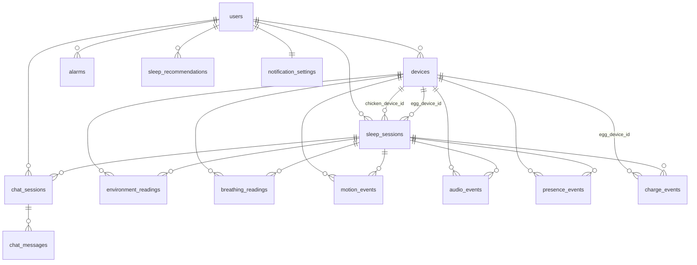

# ねるコッコ ソフトウェア仕様書 ver4

創造設計 4班 SW仕様パート担当：愛琉
更新：鶏ユニットのハードウェア変更（ESP32→Raspberry Pi 3 Model B）を反映

> **ver3からの変更点**：当初は鶏・たまご共にESP32を使う計画だったが、ミリ波レーダー（Acconeer A111）の公式対応プラットフォームがRaspberry Pi向けだったため、学校保有の無償Raspberry Pi 3Bを鶏ユニットに採用する方針に変更した。本資料はこの変更を反映し、あわせて充電検知IC（TP4056→実際の採用部品であるMCP73831/SFE-PRT-14380）とマイク型番（INMP441→実際の採用部品であるSPH0645LM4H）の記載も実態に合わせて修正している。

## 1. 開発環境・開発ツール（確定内容）

| 領域 | 決定内容 |
|---|---|
| Webアプリ | Next.js（React + TypeScript） |
| 鶏ユニット | Raspberry Pi 3 Model B、Python、Acconeer公式SDK（A111制御）、bleak（BLE Central） |
| たまごファームウェア開発ツール | PlatformIO（VSCode拡張） |
| BLE通信ライブラリ（たまご側） | NimBLE-Arduino |
| バックエンド／DB | Supabase（PostgreSQL + Edge Functions + Realtime + Auth + Storage） |
| 鶏⇔サーバー通信 | HTTP REST |
| 鶏⇔たまご通信 | BLE（たまご→鶏の一方向Notify、詳細は `docs/ble-protocol.md`） |
| AI連携 | Gemini API（Edge Function経由） |
| カレンダー連携 | Google Calendar API（Edge Function経由） |
| 音声認識／音声合成 | Google Cloud Speech-to-Text ／ Text-to-Speech |

## 2. データ構造（詳細版・全14テーブル）

`sleep_sessions`を中心に、計測系（environment/breathing/motion/audio/presence/charge）・アラーム系・会話系・設定系に分割している。テーブル構成自体はハードウェア変更（ESP32→Raspberry Pi）の影響を受けないため、ver3の内容を踏襲する。

### 1. users（ユーザー）
| カラム名 | 型 | 制約 |
|---|---|---|
| id | uuid | PK, default gen_random_uuid() |
| email | text | UNIQUE, NOT NULL |
| display_name | text | NOT NULL |
| created_at | timestamptz | NOT NULL, default now() |

インデックス：UNIQUE INDEX ON users(email)

### 2. devices（デバイス管理）
鶏ユニット・たまごユニットそれぞれをレコードとして管理する。1ユーザーにつき鶏1台・たまご1台を想定。

| カラム名 | 型 | 制約 |
|---|---|---|
| id | uuid | PK, default gen_random_uuid() |
| user_id | uuid | FK → users.id, NOT NULL |
| type | text | NOT NULL, CHECK (type IN ('chicken','egg')) |
| mac_address | text | UNIQUE, NOT NULL（鶏はRaspberry PiのWi-Fi MACアドレス、たまごはESP32のBLE MACアドレス） |
| firmware_version | text | NOT NULL（鶏はPythonアプリのバージョン、たまごはPlatformIOビルドのバージョンを格納） |
| battery_level | integer | NULL可（たまごのみ使用。鶏はMicroUSB給電のためNULL固定） |
| last_seen | timestamptz | NULL可 |
| paired_at | timestamptz | NOT NULL, default now() |

インデックス：INDEX ON devices(user_id) ／ UNIQUE INDEX ON devices(mac_address)

### 3. sleep_sessions（睡眠セッション）
「就寝準備」〜「朝の振り返り」までの1回分の睡眠計測を表す中心的テーブル。他の計測系テーブルはすべてここへ外部キーで紐づく。

| カラム名 | 型 | 制約 |
|---|---|---|
| id | uuid | PK, default gen_random_uuid() |
| user_id | uuid | FK → users.id, NOT NULL |
| chicken_device_id | uuid | FK → devices.id, NOT NULL |
| egg_device_id | uuid | FK → devices.id, NOT NULL |
| start_time | timestamptz | NOT NULL（就寝準備開始時刻） |
| end_time | timestamptz | NULL可（記録終了時刻） |
| planned_wake_time | timestamptz | NOT NULL |
| actual_wake_time | timestamptz | NULL可（アラーム停止時刻） |
| status | text | NOT NULL, CHECK (status IN ('in_progress','completed','aborted')) |
| score | integer | NULL可, CHECK (score BETWEEN 0 AND 100) |

インデックス：INDEX ON sleep_sessions(user_id, start_time DESC) ／ INDEX ON sleep_sessions(status)

### 4. environment_readings（環境データ）
温湿度・照度の定期ポーリング値。BLE Characteristic「Environment」経由でたまごから受信し、鶏がSupabaseへ送信する。

| カラム名 | 型 | 制約 |
|---|---|---|
| id | bigint | PK, identity |
| session_id | uuid | FK → sleep_sessions.id, NOT NULL |
| device_id | uuid | FK → devices.id, NOT NULL |
| timestamp | timestamptz | NOT NULL |
| temperature_c | numeric(4,1) | NULL可 |
| humidity_pct | numeric(4,1) | NULL可, CHECK (0-100) |
| illuminance_lux | numeric(6,1) | NULL可 |

インデックス：INDEX ON environment_readings(session_id, timestamp)

### 5. breathing_readings（呼吸データ）
ミリ波レーダー（主・鶏のA111、Acconeer公式SDK `sleep_breathing` モジュールで処理）・マイク（補助）による呼吸数推定値。

| カラム名 | 型 | 制約 |
|---|---|---|
| id | bigint | PK, identity |
| session_id | uuid | FK → sleep_sessions.id, NOT NULL |
| device_id | uuid | FK → devices.id, NOT NULL |
| timestamp | timestamptz | NOT NULL |
| breaths_per_min | numeric(4,1) | NOT NULL |
| signal_source | text | NOT NULL, CHECK (signal_source IN ('mmwave','mic')) |

インデックス：INDEX ON breathing_readings(session_id, timestamp)

### 6. motion_events（寝返りイベント）
加速度センサー（主・たまご、BLE Characteristic「Motion Event」）・ミリ波レーダー（補助・鶏）による寝返り検知記録。

| カラム名 | 型 | 制約 |
|---|---|---|
| id | bigint | PK, identity |
| session_id | uuid | FK → sleep_sessions.id, NOT NULL |
| device_id | uuid | FK → devices.id, NOT NULL |
| timestamp | timestamptz | NOT NULL |
| intensity | numeric(5,2) | NULL可（加速度変化量） |
| detection_source | text | NOT NULL, CHECK (detection_source IN ('accelerometer','mmwave')) |

インデックス：INDEX ON motion_events(session_id, timestamp)

### 7. audio_events（いびき・寝言イベント）
マイクの音響パターン検出（エンベロープ検出＋FFT）による記録。鶏側（SPH0645LM4H、I2S）・たまご側（ADA-4346、PDM、BLE Characteristic「Audio Level」経由）の両方が対象。

| カラム名 | 型 | 制約 |
|---|---|---|
| id | bigint | PK, identity |
| session_id | uuid | FK → sleep_sessions.id, NOT NULL |
| device_id | uuid | FK → devices.id, NOT NULL |
| timestamp | timestamptz | NOT NULL |
| event_type | text | NOT NULL, CHECK (event_type IN ('snore','sleep_talk')) |
| duration_ms | integer | NOT NULL |
| confidence | numeric(3,2) | NULL可, CHECK (0.00-1.00) |

インデックス：INDEX ON audio_events(session_id, timestamp)

### 8. presence_events（在床・離床イベント）
鶏のミリ波レーダーによる在床/離床の状態変化を記録。

| カラム名 | 型 | 制約 |
|---|---|---|
| id | bigint | PK, identity |
| session_id | uuid | FK → sleep_sessions.id, NOT NULL |
| device_id | uuid | FK → devices.id, NOT NULL |
| timestamp | timestamptz | NOT NULL |
| state | text | NOT NULL, CHECK (state IN ('in_bed','out_of_bed')) |

インデックス：INDEX ON presence_events(session_id, timestamp)

### 9. charge_events（充電開始・停止イベント）
たまごの充電モジュール（**SFE-PRT-14380、MCP73831搭載**）のSTATピン監視結果。二度寝防止ロジック（巣に戻った判定）の根拠データ。BLE Characteristic「Dock Event」として、たまご→鶏へ一方向でNotify送信される。

| カラム名 | 型 | 制約 |
|---|---|---|
| id | bigint | PK, identity |
| egg_device_id | uuid | FK → devices.id, NOT NULL |
| session_id | uuid | FK → sleep_sessions.id, NULL可 |
| timestamp | timestamptz | NOT NULL |
| event_type | text | NOT NULL, CHECK (event_type IN ('charge_start','charge_stop')) |

インデックス：INDEX ON charge_events(egg_device_id, timestamp DESC)

### 10. alarms（アラーム設定）
ユーザーが設定する起床アラーム。曜日ごとの繰り返しに対応。

| カラム名 | 型 | 制約 |
|---|---|---|
| id | uuid | PK, default gen_random_uuid() |
| user_id | uuid | FK → users.id, NOT NULL |
| time | time | NOT NULL |
| repeat_days | smallint[] | NOT NULL, default '{0,1,2,3,4,5,6}'（0=日〜6=土） |
| enabled | boolean | NOT NULL, default true |
| created_at | timestamptz | NOT NULL, default now() |
| updated_at | timestamptz | NOT NULL, default now() |

インデックス：INDEX ON alarms(user_id)

### 11. sleep_recommendations（就寝提案）
カレンダー連携＋LLMによる「今夜の推奨就寝時刻」。日付ごとに1件。

| カラム名 | 型 | 制約 |
|---|---|---|
| id | uuid | PK, default gen_random_uuid() |
| user_id | uuid | FK → users.id, NOT NULL |
| target_date | date | NOT NULL |
| recommended_bedtime | timestamptz | NOT NULL |
| required_sleep_minutes | integer | NOT NULL |
| reasoning | text | NULL可（Geminiが生成した理由文） |
| generated_at | timestamptz | NOT NULL, default now() |

インデックス：UNIQUE INDEX ON sleep_recommendations(user_id, target_date)

### 12. chat_sessions（会話セッション）
1回分の会話のまとまり。ボタン起動／夕方の自動提案／朝の自動通知のいずれかを起点とする。

| カラム名 | 型 | 制約 |
|---|---|---|
| id | uuid | PK, default gen_random_uuid() |
| user_id | uuid | FK → users.id, NOT NULL |
| sleep_session_id | uuid | FK → sleep_sessions.id, NULL可 |
| trigger | text | NOT NULL, CHECK (trigger IN ('button','scheduled_evening','scheduled_morning')) |
| started_at | timestamptz | NOT NULL, default now() |
| ended_at | timestamptz | NULL可 |

インデックス：INDEX ON chat_sessions(user_id, started_at DESC)

### 13. chat_messages（会話メッセージ）
ユーザー発話・AI応答の1発言単位のログ。

| カラム名 | 型 | 制約 |
|---|---|---|
| id | bigint | PK, identity |
| chat_session_id | uuid | FK → chat_sessions.id, NOT NULL |
| role | text | NOT NULL, CHECK (role IN ('user','assistant')) |
| content | text | NOT NULL |
| audio_url | text | NULL可（Supabase Storage上の音声ファイルURL） |
| created_at | timestamptz | NOT NULL, default now() |

インデックス：INDEX ON chat_messages(chat_session_id, created_at)

### 14. notification_settings（通知・キャラ設定）
ユーザー単位の通知ON/OFFとキャラクターボイス設定。

| カラム名 | 型 | 制約 |
|---|---|---|
| id | uuid | PK, default gen_random_uuid() |
| user_id | uuid | FK → users.id, UNIQUE, NOT NULL |
| evening_suggestion | boolean | NOT NULL, default true |
| morning_score | boolean | NOT NULL, default true |
| character_voice | text | NOT NULL, default 'rooster', CHECK (character_voice IN ('rooster','chick')) |

インデックス：UNIQUE INDEX ON notification_settings(user_id)

### ER図（テーブル関連図）

## 3. データフロー（ソフトウェア視点）

**鶏ユニット（Raspberry Pi 3B / Python）が中枢（ゲートウェイ）となる4層構成**：デバイス層（鶏：Raspberry Pi、たまご：ESP32）、クラウド層（Supabase）、外部API層（Google STT/TTS、Gemini、Google Calendar）、アプリ層（Next.js Webアプリ）。

- **たまご → 鶏**：BLE（NimBLE-Arduino → bleak、たまごPeripheral／鶏Central、一方向Notifyのみ）
- **鶏 → クラウド**：HTTP REST（鶏のPythonアプリからSupabase Edge Functionへ定期POST。センサーデータは鶏本体分＋BLE経由のたまご分をまとめて1レコードとして送信）
- **クラウド → アプリ**：Realtime（WebSocket配信）
- **アプリ ⇔ クラウド**：Supabase Clientによる通常のCRUD

### 3-1. 補足：Edge Function構成

| Edge Function名 | 役割 | 呼び出し元／トリガー |
|---|---|---|
| ingest-sensor-data | 各種センサー値・イベントをDBへ書き込み | 鶏（Raspberry Pi）からのHTTP POST（定期送信。たまごのBLEデータも鶏が集約して送信） |
| voice-chat | STT→Gemini→TTSを直列実行し音声応答を返す | 鶏（Raspberry Pi）からのHTTP POST（トサカボタン押下時） |
| evening-suggestion | Google Calendar取得→推奨就寝時刻をGeminiで生成 | Supabase Scheduled Trigger（毎日19:00） |
| morning-summary | 前夜のセンサーデータを集計しスコア算出＋Geminiコメント生成 | charge_events（巣に戻ったイベント）検知をトリガー |

## 4. フローチャート（テキスト版）

### 4-1. 1日の状態遷移（詳細版）

1. 開始（前回起床 or アプリ初期化）
2. 夕方確認フェーズ：Google Calendar取得→Gemini推奨就寝時刻生成 [write: sleep_recommendations]
3. ユーザーが就寝準備を開始？ No→通知のみ継続してループ／Yes→次へ
4. 就寝準備フェーズ：sleep_sessions作成（status=in_progress）、たまごをベッドにセット [write: sleep_sessions]
5. 睡眠記録フェーズ：鶏（A111・SPH0645LM4H）＋たまご（BLE経由：加速度／マイク／温湿度／照度）を定期送信 [write: motion_events, breathing_readings, audio_events, environment_readings]
6. 起床予定時刻に到達？ No→継続計測してループ／Yes→次へ
7. 起床制御フェーズ：LED点灯＋アラーム鳴動開始（在床確認は行わない）
8. たまごが巣に戻った？（charge_events検知） 受信未確認→BLE再送（受信確認タイムアウト時）／確認済み→次へ
9. アラーム停止：sleep_sessions更新（status=completed, actual_wake_time記録） [write: sleep_sessions]
10. 朝の振り返りフェーズ：スコア算出バッチ実行、Geminiでコメント生成 [write: sleep_sessions.score, chat_messages]
11. 1日の終了（翌日の夕方確認へ）

### 4-2. 起床・二度寝防止シーケンス（詳細版）

BLE通信失敗時の再送ロジック（最大3回）と、鶏（Raspberry Pi）によるWi-Fi経由のフォールバック経路を含む。

1. 開始：起床予定時刻（planned_wake_time）到達
2. 【鶏】アラーム鳴動開始：LED点灯＋コケコッコー音（在床確認は行わない、検知ミス回避のため）
3. ユーザーが起床し、たまごを巣に戻す（手動動作）
4. 【たまご】充電モジュール（MCP73831）のSTATピン監視、充電開始を検知
5. 【たまご→鶏】BLE Notify送信（Dock Event Characteristic、charge_startイベント相当）
6. 【鶏】受信確認（ACK相当の受信）が来たか？ No→たまご側で一定時間（例：2秒）後に再送信（最大3回）
7. 再送3回でタイムアウト？ Yes→フォールバック：鶏（Raspberry Pi）がWi-Fi経由でSupabase DBのcharge_eventsをポーリング確認（BLE代替経路）
8. 【鶏】アラーム停止、LED消灯
9. sleep_sessions更新：status='completed', actual_wake_time=now()、charge_eventsにINSERT
10. 起床シーケンス完了→朝の振り返りフェーズへ

### 4-3. 音声対話フロー（新規・詳細版）

ボタン押下からAI応答再生までの一連の処理を、各ステップでのエラーハンドリング（無音・API障害時のフォールバック応答）まで含めて示す。

1. 開始：トサカボタン押下
2. LED点灯（聴取中演出）、会話モード起動
3. マイク（**SPH0645LM4H**、鶏本体）で録音（発話終了 or 最大5秒で自動停止）
4. 録音データを鶏（Raspberry Pi）からHTTP POSTでSupabase Edge Function（voice-chat）へ送信
5. 送信成功？ No（Wi-Fi不安定等）→エラー音＋LED点滅「聞こえなかったコケ」→3へ戻る／Yes→次へ
6. Google Cloud STTを呼び出し、音声→テキスト変換
7. 認識成功？（無音／雑音でないか） No→「もう一回言ってコケ」再入力を促す音声再生→3へ戻る／Yes→次へ
8. chat_messages履歴＋sleep_sessions最新データをコンテキストとしてGemini API呼出、にわとりキャラの応答生成
9. 生成成功？ No（タイムアウト/API障害）→定型フォールバック応答「ちょっと今考え中…」／Yes→次へ
10. Google Cloud TTSで応答テキストを音声化（にわとり/ひよこボイス設定を反映）
11. chat_messagesにuser発話・assistant応答をINSERT
12. LED発光パターン変更（発話中演出）
13. 鶏スピーカー（MAX98357A）で応答音声を再生
14. 続けて会話する？（再度ボタン押下 or 無音3秒で終了） Yes→3へ戻る／No→会話モード終了、LED消灯

## 5. 今後の課題（更新）

- ウェイクワード検出の実装可否・工数見積もり
- 音声対話のレイテンシ短縮策の検討（プロンプト短文化、発話終了検出の実装等）
- STT/TTSのAPI利用料金の試算（想定利用回数ベース）
- Row Level Security（RLS）ポリシーの設計（ユーザーが自分のデータのみ参照できるようにする）
- sleep_sessions.score の算出アルゴリズムの確定（既存研究の調査・重み付け設計）
- Supabase Storageの音声ファイル保持期間・容量上限の検討
- 起床検知トリガー（Dock Event）でのスコア計算バッチ発火タイミングの最終確認（C担当・B担当ですり合わせ中）
